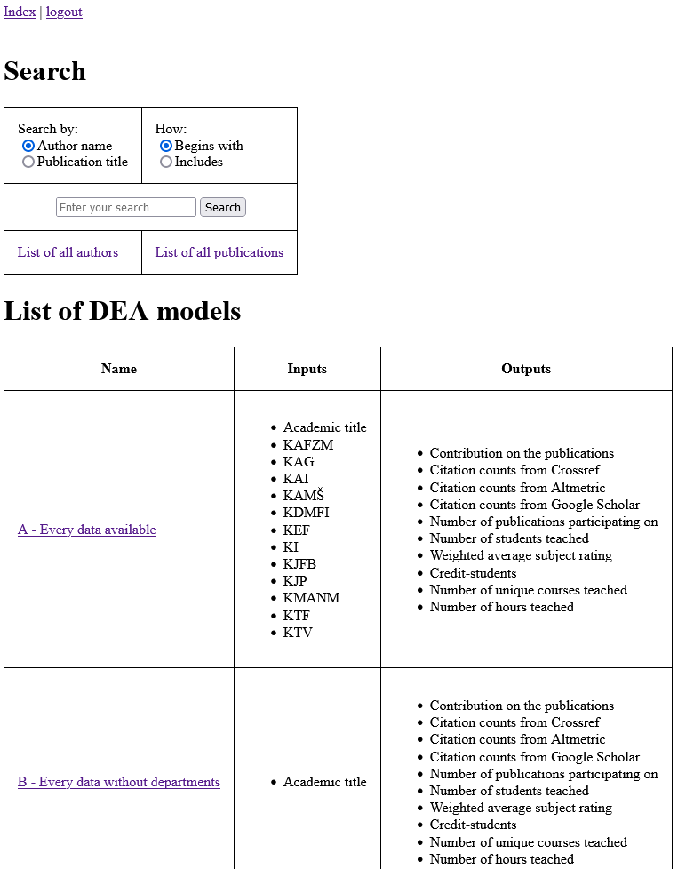
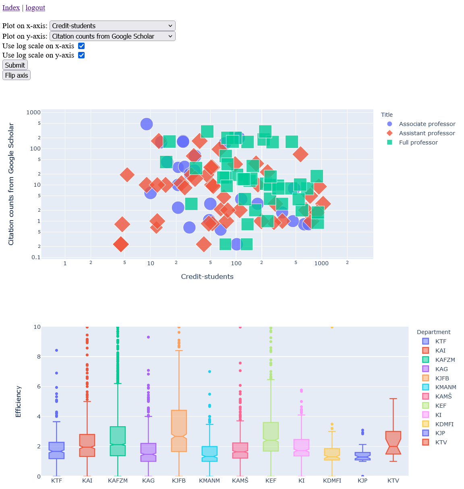
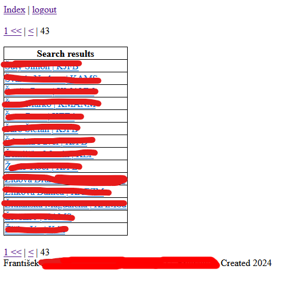
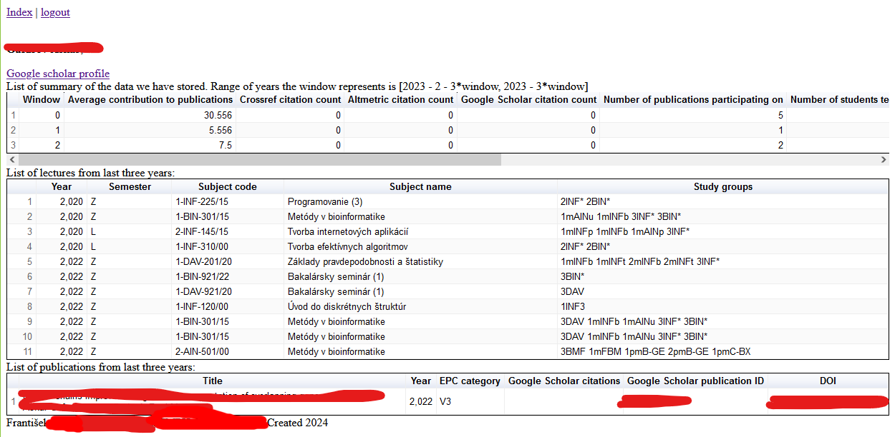
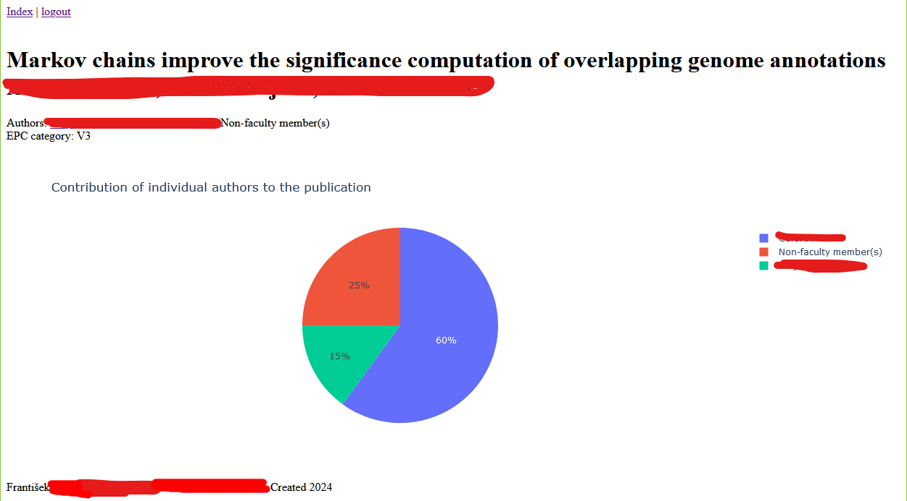

Source codes for Flask web server displaying data, as part of bachelor thesis concentrating on data mining about publishing and teaching activities of faculty members. Data not actually present as they are confidential, only working subpage is index.

For running the app, use makefile recipe `make flask`. This will run app in the development server. Before running flask, you need to set up libraries needed, use `make setup`. 

Website uses Plotly Express and Google Charts for plotting and tables.

Built in Python3.11

# Contents of the website
Index: lists simple search form and list of DEA models

Search: lists results of search query in a paginated table

Author: displays data collected about a person

Publication: displays data about a publication

DEA: displays plots with data from DEA models

# Contens of the repository:
Makefile with recipes to run

requirements.txt: Python libraries required for the server

flask_app/flask_app.py: primary file for flask server, creates the app and connects blueprints

flask_app/routes/*: routes for flask app, split into several files by function

flask_app/templates/*: templates for the web server

databases/joint_database.db: SQlite database with all the data for our app. Here the database is empty.

model_data/toc.json: list of DEA models with their properties

model_data/{name}.csv: data for DEA model, not present here.

# Screenshots:
/index

/dea

/search

/author

/publication

